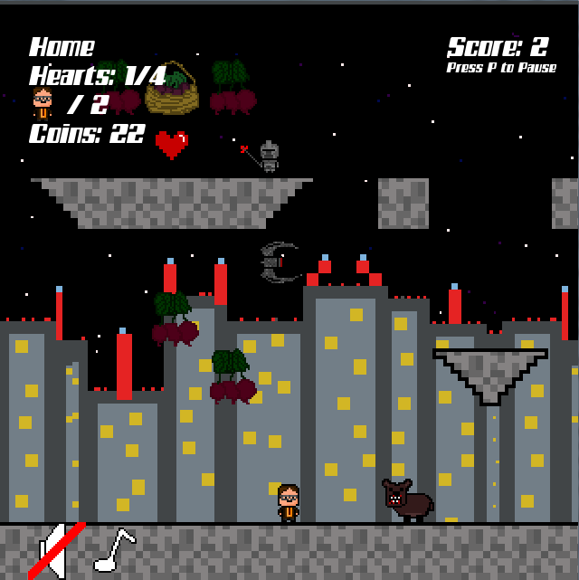
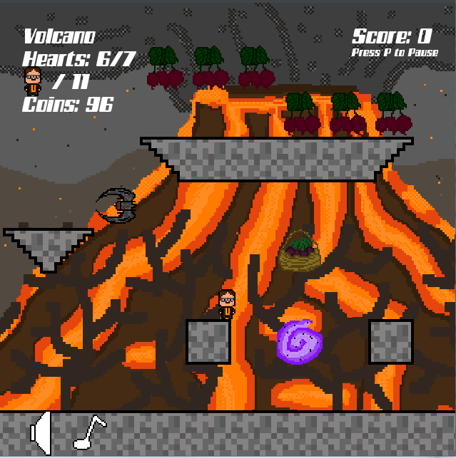

# What is Bears, Beets, Battlestar Galactica?

As a big fan of the show _The Office_, I decided to make a game themed off of one of the most memorable lines in the show. Dwight Shrute is by far the most memorable character on the TV show, and I wanted this game to give a window into his self-consious and love for Battlestar Galactica. 
You can view the [repository on GitHub](https://github.com/awuerf4505/bears_beets_bg_game/edit/master/README.md) to see the actual code of the game.

___You must have Python Version 3.4.4 and Pygame Version 1.9.2 in order for the game to function properly!!!___
## How to Play

### Goal

The goal of the game is to make it to the checkpoints at the end of each level so Dwight can continue the legacy of Battlestar Galactica to the ends of the universe while collecting as many beets as possible to stay alive.

### Controls
*	Left Arrow – run left slow
*	Right Arrow – run right slow
*	Up Arrow – run right fast
*	Down Arrow – run left fast
*	P – pause
*	M – turn on and off music
*	S – turn on and off sound
*	SPACE – jump 

### Enemies
* Bears
  * Most common enemy throughout the levels
  * Removes one heart
* Cylon Guard
  * Only enemy limited to the space on their designated platform
  * Removes one heart
* Flying Cylon Raider
  * Patrols all of the levels from the air
  * Removes one heart
  

### Powerups/Power...downs
* Green Bubbles and Hearts
  * Gives one life to Dwight
* Red Bubbles
  * Removes one point from Dwight's score
  
### Magic!!!
This is an added element thst serves as an obstacle for Dwight. Each magic removes one life from Dwight.

### Beets
There are two differnet types of beets that Dwight can collect: individual beets and beet baskets.
* Individual Beets
  * Each, when collected, give one point to Dwight and give him one beet
* Beet Baskets
  * The baskets are worth 5 individual beets and each add 5 points to Dwight while also giving him 5 beets

### Mini Flags
These small objects give Dwight one heart

